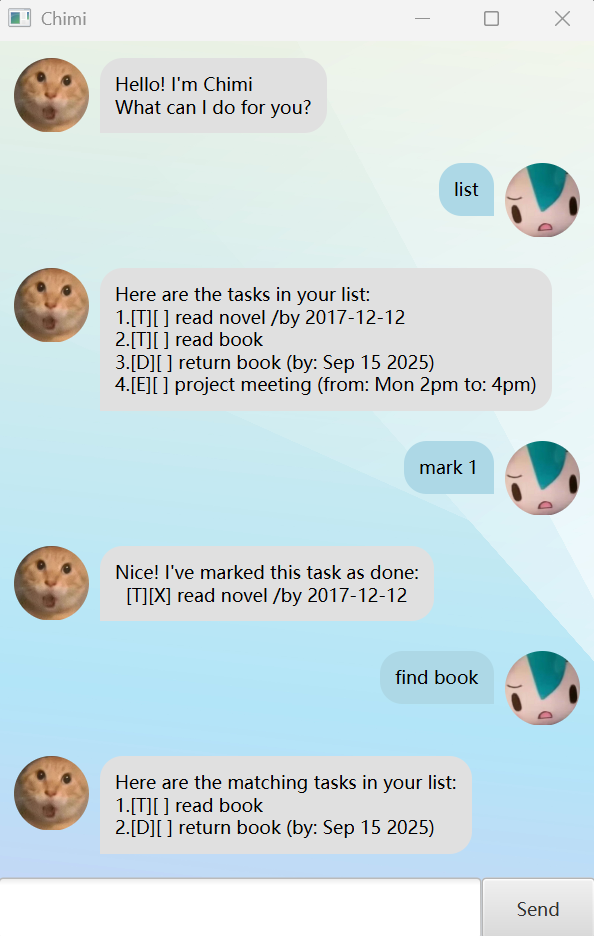

# Chimi User Guide



Chimi is a **personal task tracker chatbot** that helps you manage your todos, deadlines, and events via a simple chat interface. Launch the app and start typing commands!

---

## Quick Start

1. Ensure you have **Java 17** installed.
2. Download the latest `chimi.jar` from the [Releases](https://github.com/) page.
3. Run it with: `java -jar chimi.jar`

---

## Features

### Listing all tasks: `list`

Shows all tasks currently in your list.

**Format:** `list`

**Example:**
```
list
```
**Expected output:**
```
Here are the tasks in your list:
1.[T][ ] read book
2.[D][ ] return book (by: Sep 15 2025)
3.[E][ ] project meeting (from: Mon 2pm to: 4pm)
```

---

### Adding a todo: `todo`

Adds a basic task with no date.

**Format:** `todo DESCRIPTION`

**Example:**
```
todo read book
```
**Expected output:**
```
Got it. I've added this task:
  [T][ ] read book
Now you have 1 tasks in the list.
```

---

### Adding a deadline: `deadline`

Adds a task with a specific due date. The date must be in `yyyy-mm-dd` format.

**Format:** `deadline DESCRIPTION /by DATE`

**Example:**
```
deadline return book /by 2025-09-15
```
**Expected output:**
```
Got it. I've added this task:
  [D][ ] return book (by: Sep 15 2025)
Now you have 2 tasks in the list.
```

---

### Adding an event: `event`

Adds a task with a start and end time.

**Format:** `event DESCRIPTION /from START /to END`

**Example:**
```
event project meeting /from Mon 2pm /to 4pm
```
**Expected output:**
```
Got it. I've added this task:
  [E][ ] project meeting (from: Mon 2pm to: 4pm)
Now you have 3 tasks in the list.
```

---

### Marking a task as done: `mark`

Marks the task at the given index as completed.

**Format:** `mark INDEX`

**Example:**
```
mark 1
```
**Expected output:**
```
Nice! I've marked this task as done:
  [T][X] read book
```

---

### Unmarking a task: `unmark`

Marks the task at the given index as not done.

**Format:** `unmark INDEX`

**Example:**
```
unmark 1
```
**Expected output:**
```
OK, I've marked this task as not done yet:
  [T][ ] read book
```

---

### Deleting a task: `delete`

Removes the task at the given index from your list.

**Format:** `delete INDEX`

**Example:**
```
delete 2
```
**Expected output:**
```
Noted. I've removed this task:
  [D][ ] return book (by: Sep 15 2025)
Now you have 2 tasks in the list.
```

---

### Finding tasks by keyword: `find`

Searches for all tasks whose description contains the given keyword.

**Format:** `find KEYWORD`

**Example:**
```
find book
```
**Expected output:**
```
Here are the matching tasks in your list:
1.[T][ ] read book
```

---

### Exiting the program: `bye`

Closes the chatbot.

**Format:** `bye`

---

## Special Features

### Duplicate Detection

Chimi automatically prevents you from adding a task if an **identical** one already exists in your list. Two tasks are considered identical if they share the same description and (for deadlines/events) the same dates.

**Example:**
```
todo read book
```
If `read book` already exists:
```
Error: Hold on! This exact task already exists in your list.
```

### Auto-Save

Your tasks are automatically saved to disk after every change. When you relaunch Chimi, all your tasks will still be there.

---

## Command Summary

| Command    | Format                                       |
|------------|----------------------------------------------|
| `list`     | `list`                                       |
| `todo`     | `todo DESCRIPTION`                           |
| `deadline` | `deadline DESCRIPTION /by DATE`              |
| `event`    | `event DESCRIPTION /from START /to END`      |
| `mark`     | `mark INDEX`                                 |
| `unmark`   | `unmark INDEX`                               |
| `delete`   | `delete INDEX`                               |
| `find`     | `find KEYWORD`                               |
| `bye`      | `bye`                                        |
